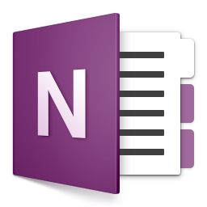
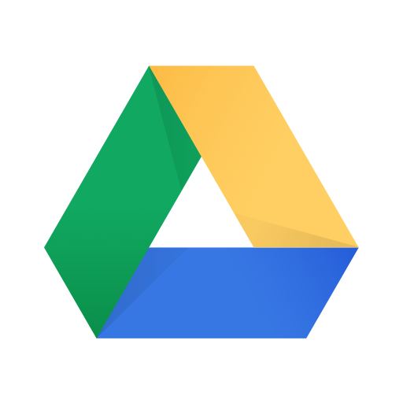

Nowadays, there are a lot of productivity tools that can help us to save time, free the mind for more important thing, save our life, etc. This is even more important to me, who do many kinds of task as well as lot of tasks to do and a daughter to play with.

Below are my most important daily-use tools that have saved my life. I won't list too familiar things like: web browsers, IDE, Git client, mail client, etc.

### [Wunderlist](https://www.wunderlist.com/)

  

My brain's best friend. It is a strong To-Do application on multiple platforms. I will be surprise if you don't have any To-Do application (why can you live without it?).

Some points that made me love Wunderlist;

- Multiple list
- A list can be shared to other users
- Lists can be grouped
- Flexible reminder and repeat
- We can add subtask and note for each to-do item
- Fast cloud synchronization
- Support multiple platforms: macOS, Windows, Android, iOS

Wunderlist is being replaced by Microsoft To-Do, hope it will be even better with Microsoft team. I have not migrated to it yet because it doesn't have macOS version (yet)

### [OneNote](https://www.onenote.com/)

  

A bit heavy but very good notes application from Microsoft. I used EverNote before but it lacks many features for my needs.

Important OneNote's features for me:

- Split notes to be books, sections and pages. This gives us power to organize the notes our way
- Password protected sections. It is important for sensitive notes
- Multi-platform and cloud synchronization

### [Lastpass](https://www.lastpass.com/)

  

Too tired with remembering passwords or creating strong passwords? Want to share passwords in secured way? Lastpass can help you. Since I manage tons of accounts, this is my life-saver

### [Markdown Preview](https://packagecontrol.io/packages/Markdown%20Preview)

I usually need to write documents or formated messages and my selected markup language is Markdown (believe me, it is fun way to write documents and messages). To turn the Markdown document to friendly formated document, I use Markdown Preview (a package for Sublime Text) to build the Markdown file to self-contain HTML file

### [Postman](https://www.getpostman.com/)

  

Must-have tool when you work with webservices (API). It is easy to use and has:

- Flexible requests, you can use (or convert to) many request types: cURL, Ruby, Swift, etc.
- Collection of requests
- Share-able collections

### [Google Drive](https://www.google.com/intl/en/drive/)

  

It is so familiar, right? I still list it here because it is very important to me. It helps me switch between devices smoothly and ensure all important data are backed up in realtime. Mostly all of my output for daily works are synced to Google Drive instantly

