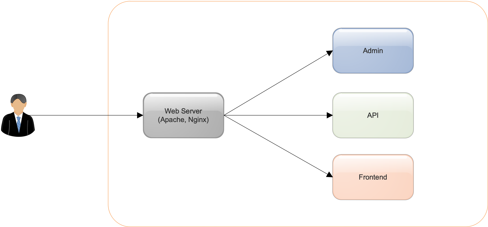
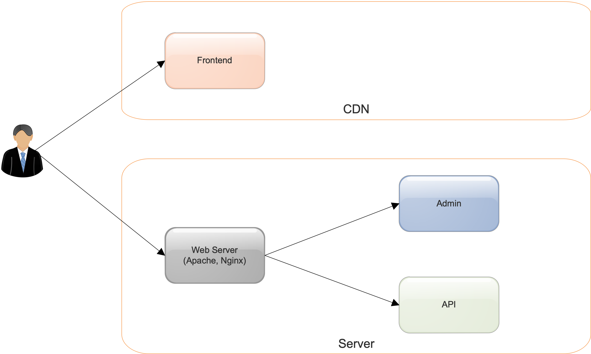

SPA (single-page application) becomes popular nowadays due to its undoubtable advantages. So, our web applications often have 2 parts:

- Frontend, which is built with some popular frontend libraries like React, Vue.js, Angular. This part shows the UI to the users and communicate with the backend via the API or GraphQL
- Backend: provides the API to handle the requests from the frontend and some other things like admin panel

That's how we structure the system in coding. How's about the infrastructure design?

####1. Traditional approach

  

- Single Git repository for frontend and backend
- The frontend is managed by backend framework (like Ruby on Rails, Laravel, Django) assets pipeline or independent webpack is used to build the frontend to `public` folder of the backend framework
- Frontend and backend in this repository will be deployed to the same server(s). The URL structure often looks like:

    + `https://abc.com`: the frontend
    + `https://abc.com/api/*`: the API
    + `https://abc.com/admin/*`: admin panel or something like that

Although this seems to be easier for the beginners (because they can use the familiar backend framework to manage the frontend part), it has many disadvantages:

- It uses the server's resources (connections, bandwidth, etc.), which could be used only for the backend
- No CDN itself (we are still able to wrap the server with some CDN like Cloudflare)
- Unnecessary builds for backend/frontend if we need updates on one of them only, i.e: we need to deploy both frontend and backend although we only need to change frontend
- A bit more difficult to let the frontend developers jump into the frontend part because the frontend developers are often not familiar to backend frameworks

####2. Modern approach

  

- Separate Git repositories for frontend and backend
- The frontend is an independent project with its own building approach
- The backend can be API-only or full-stack application
- Frontend and backend are deployed separately on different servers
- The URL structure often looks like:

    + `https://abc.com`: the frontend
    + `https://api.abc.com`: the API
    + `https://admin.abc.com`: the admin panel or something like that

This approach resolves the traditional approach's issues that we have mentioned above. Additionally, we can host the frontend for free with the favor of popular CDN-by-default static hostings like:

- [Firebase Hosting](https://firebase.google.com/products/hosting)
- [Netlify](https://www.netlify.com/)

These static hosting often provides simple CLI commands to deploy and rollback deployments, so they are very easy to be integrated to our deployment scripts of CI process.