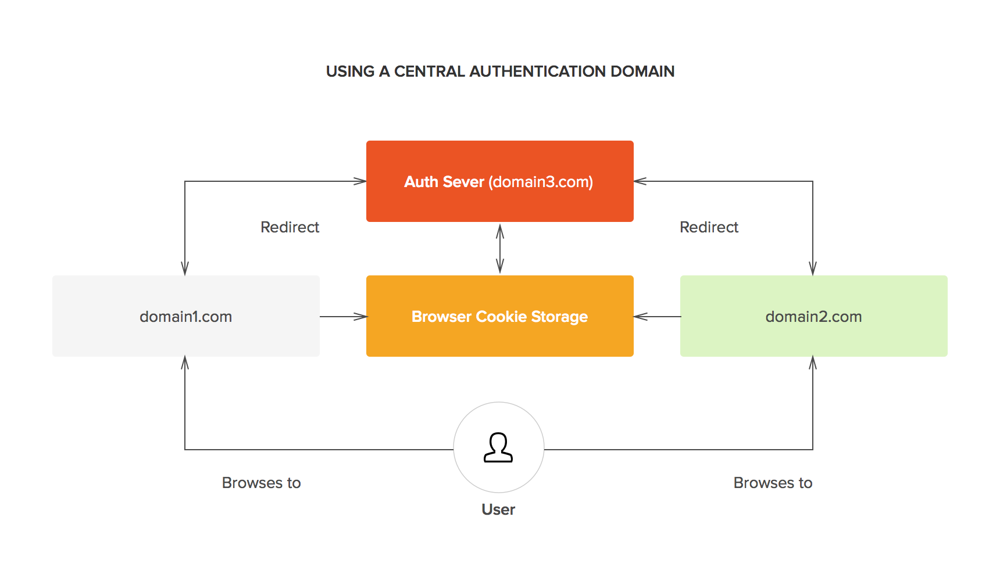

# Single Sign-On with Rails

#### What is Single Sign-On (SSO)?
Single sign-on (SSO) is an authentication process that allows a user to access multiple applications with one set of login credentials. 

#### How SSO works?

<center>
  
</center>

Steps:
- User browses domain1.com
- User is redirected to domain3.com for authentication
- User logged into domain3.com (skip if user already logged into domain3.com)
- User is redirected to domain1.com with a (encrypted) token
- domain1.com uses token for authentication
<br/>(Similar for domain2.com)

<center>
  
</center>

#### Why SSO?
- User experience: Users don't need to remember and don't need to input their credentials for each website they browse. It's saving users time and IT cost also. 
- Security: Users only provide credential for central SSO servers (often high security capacity such as Facebook, Google ...) 

#### SSO with Rails

**SSO with famous central authentication domain (Facebook/Google...)**

You may hear about some concept *Login with Facebook*, *Login via Google*. They're all the instances of SSO concept. 

In order to implement, we will use a Gem called [omniauth](https://github.com/omniauth/omniauth).

Here some basic steps to use [omniauth](https://github.com/omniauth/omniauth) for SSO authentication:
- Install gem via bundle
- Get providers keys, configure providers application redirect to your project
- Config omniauth middleware with providers you need
	````
	#config/initializers/omniauth.rb
	Rails.application.config.middleware.use OmniAuth::Builder do
	  provider :facebook, ENV['FB_KEY'], ENV['FB_SECRET']
	  provider :twitter, ENV['TWITTER_KEY'], ENV['TWITTER_SECRET']
	end
	````
- Implement redirect function when (encrypted) token is sent back from provider
	```
	#routes.rb
	get '/auth/:provider/callback', to: 'sessions#create'

	class SessionsController < ApplicationController
	  def create
	    @user = User.find_or_create_from_auth_hash(auth_hash)
	    self.current_user = @user
	    redirect_to '/'
	  end

	  protected

	  def auth_hash
	    request.env['omniauth.auth']
	  end
	end
	```

- Finally, when user go to your application, if user haven't logged in yet, you will redirect user to `/auth/<provider>` for start the SSO authentication flow

**Build a SSO authentication from scratch**
This is OK if you want to set up a SSO system for your owned projects. Here's my example to implement it with SAML.

Firstly, you need to build a central SSO server. We will use [saml_idp](https://github.com/saml-idp/saml_idp) with some steps:
- Install gem via bundle
- Generate a certificate
	```
	openssl req -x509 -sha256 -nodes -days 3650 -newkey rsa:2048 -keyout myKey.key -out myCert.crt
	```
- Add cert into server	
	```
	# config/initializers/saml_idp.rb
	SamlIdp.configure do |config|
    config.x509_certificate = File.open(ENV['sso_cert_key_path']).read.strip
    config.secret_key = File.open(ENV['sso_secret_key_path']).read.strip
	end
	```
- Add SAML routes 
```
get '/saml/auth' => 'saml_idp#new'
post '/saml/auth' => 'saml_idp#create'
```
- Create SAML controller
```
# app/controllers/saml_idp_controller.rb
class SamlIdpController < SamlIdp::IdpController
    def new
      # The following branch is your point for determining if this user has access to the service
      if user_signed_in?
        @saml_response = encode_response(current_user)
        render template: "saml_idp/idp/saml_post", layout: false
        return
      else
        redirect_to new_user_session_path
      end
    end
end
```
- Lastly, you need to configure for each domain need to authenticate via central SSO
  - Define domain
    <br/>
    We need two information: domain fingerprint and domain SAML meta data
    ```
      # config/initializers/saml_idp.rb
      service_providers = {
        "http://domain1.com" => {
          fingerprint: "26:C1:84:1F:01:87:D5:EE:05:21:05:8A:91:40:BC:0D:BE:FA:8D:B4",
          metadata_url: "http://domain1.com/auth/saml/metadata"
        }
      }
    ```
  - Define NameID format. This tells the domain where the user's information is stored.
  ```
  # As above controller, we will use User record
  # config/initializers/saml_idp.rb
    config.name_id.formats = {
      persistent: -> (user) { user }
    }
  ```
  - Lastly, we'll configure RequestedAttributes
  ```
    # Retrieve only email
    # config/initializers/saml_idp.rb
    config.attributes = {
      "Email" => {
        "name" => "email",
        "name_format" => "urn:oasis:names:tc:SAML:2.0:attrname-format:basic",
        "getter" => ->(user) {
          user.email
        }
      }
    }
  ```

Now, we will connect your domain to your central via SSO with [omniauth-saml](https://github.com/omniauth/omniauth-saml):
- Install gem via bundle
- Generate a certificate
  ```
  openssl req -x509 -sha256 -nodes -days 3650 -newkey rsa:2048 -keyout myKey.key -out myCert.crt
  ```
- Configure gem middleware to point into your central domain, also define some extra info (cert, redirect URL, )
  ```
  #config/initializers/omniauth.rb
    Rails.application.config.middleware.use OmniAuth::Builder do
    provider :saml,
      :assertion_consumer_service_url     => "https://domain1.com/users/auth/saml/callback",
      :issuer                             => "TestSSO",
      :idp_sso_target_url                 => "https://domain3.com/saml/auth",
      :idp_sso_target_url_runtime_params  => {:original_request_param => :mapped_idp_param},
      :idp_cert                           => File.open(ENV['sso_cert_key_path']).read.strip,
      :idp_cert_fingerprint               => "26:C1:84:1F:01:87:D5:EE:05:21:05:8A:91:40:BC:0D:BE:FA:8D:B4",
      :idp_cert_fingerprint_validator     => lambda { |fingerprint| fingerprint },
      :name_identifier_format             => "urn:oasis:names:tc:SAML:2.0:attrname-format:basic",
      :request_attributes                 => [
          { :name => 'email', :name_format => 'urn:oasis:names:tc:SAML:2.0:attrname-format:basic', :friendly_name => 'Email address' }
      ],
      :attribute_statements                 => {
          email: ["email"]
      }
  end
  ```
- Finally, go to `https://domain1.com/users/auth/saml`, the middleware will start the SSO authentication process, after finish authentication, it will redirect back to `https://domain1.com/users/auth/saml/callback` with user info form central domain. You can use this information for authentication
  ```
  #config/routes.rb
  devise_for :users, :controllers => {omniauth_callbacks: "omniauth_callbacks" }

  #app/controllers/omniauth_callbacks_controller.rb
  class OmniauthCallbacksController < Devise::OmniauthCallbacksController
    def saml
      info = request.env["omniauth.auth"]['info']
      #Perform authenticate actions
    end
  end
  ```


